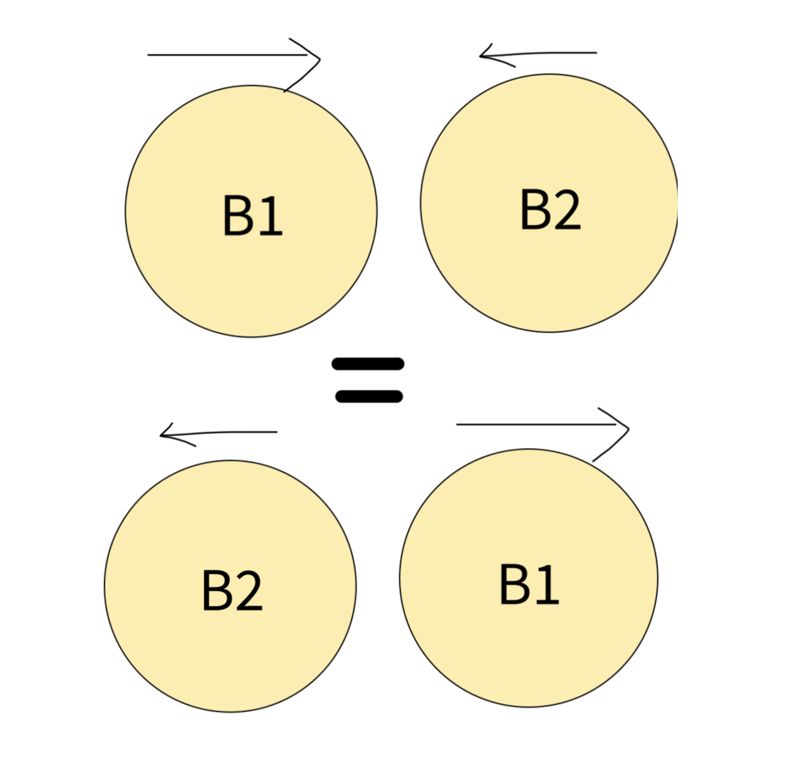

**Question**: [Movement of Robots](https://leetcode.com/problems/movement-of-robots/)
**Approach**:
First of all, we should understand the trick to get to the solution:
If Ball B1 collides with B2, the direction of each ball gets reversed. That can be interpreted as Ball B1 and B2 switched there positions. That means the answer will be same as when we ignore the collisions at all.

So, we calculate the positions after d secons ignoring the collision.

Now we sort the `pos` array since we want to use prefix sum, and get the required answer.

TC: `O(nlogn)`
SC: `O(n)`

**Code**:
```cpp
#define ll long long
const ll MOD = 1e9+7;
class Solution {
public:
    int sumDistance(vector<int>& nums, string s, int d) {
        int n = nums.size();
        // the result will be same if we ignore the collision
        vector<ll>pos(nums.begin(), nums.end());
        for(int i = 0 ; i < n ; i++){
            int val = (s[i] == 'R') ? 1 : -1;
            pos[i] = pos[i] + d*val;
        }
        sort(pos.begin(), pos.end());
        ll ans = 0;
        vector<ll>pref(n+1, 0);

        // for a3 -> a3-a0 + a3-a1 + a3-a2 => 3*a3 - pref(a3)
        for(int i = 1 ; i <= n ; i++){
            pref[i] = (pref[i-1] + pos[i-1])%MOD;
        }
        for(int i = 1 ; i < n ; i++){
            ans = (ans + i*pos[i] - pref[i])%MOD;
        }

        return (int)ans;
    }
};
```